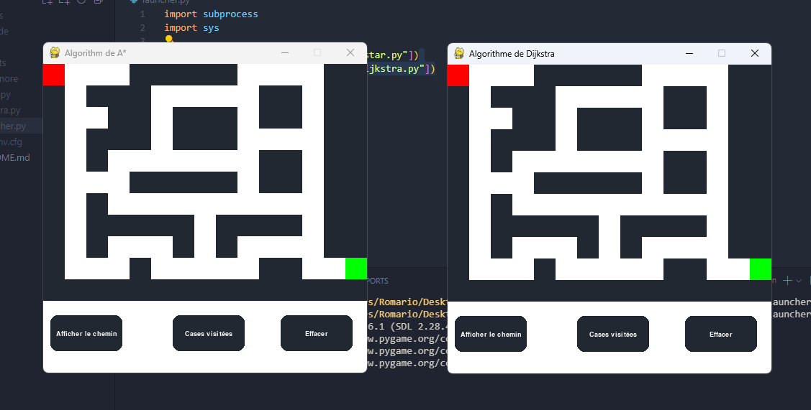
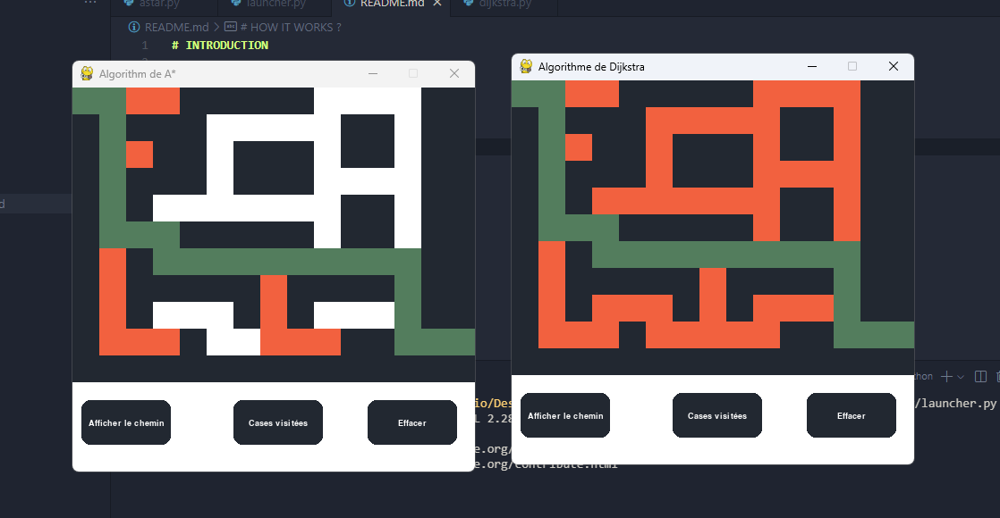

# INTRODUCTION

labyrinth game using pygame

# HOW IT WORKS ?

1. 😉 We're using `pygame` to create this game;
2. ⚒️ This is sample example to use `A* Algorithm`;
3. 🚦 We're using `heapq` modul to help us with `queue`;
4. 👌 We're using english keywords naming variables;
5. 🛩️ It's not perfect but it works.

# SCREENSHOTS

- In this first screen shot. we shaw two windows 
- One for Dijsktra's algorithm to help us to find optimized path
- One using A* algorithm

- In this second screen shot. we shaw two windows 
- One result using Dijsktra's algorithm to help us to find optimized path
- One result using A* algorithm

